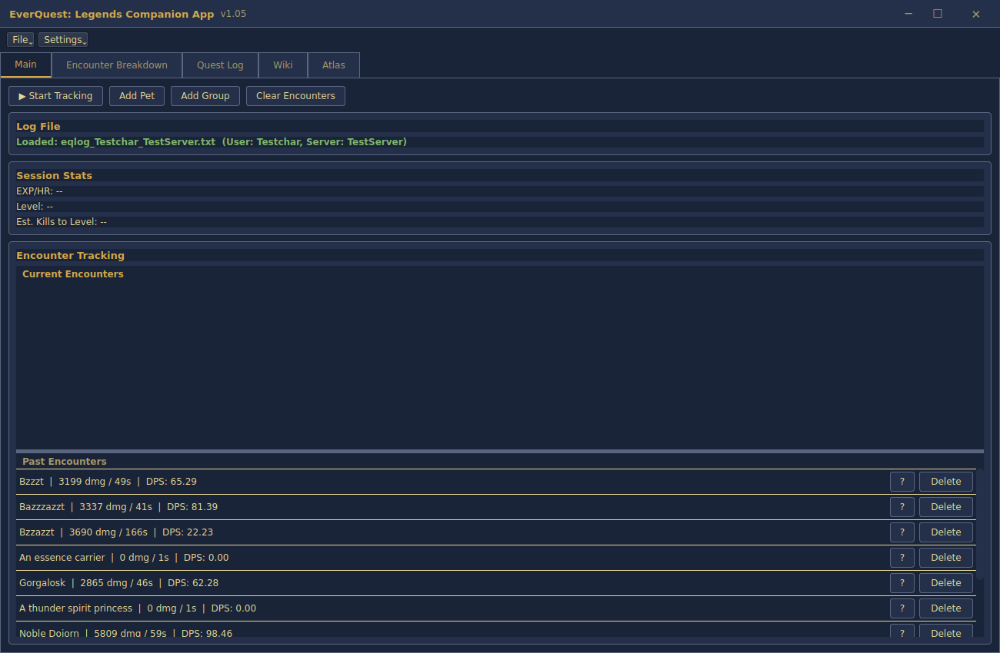
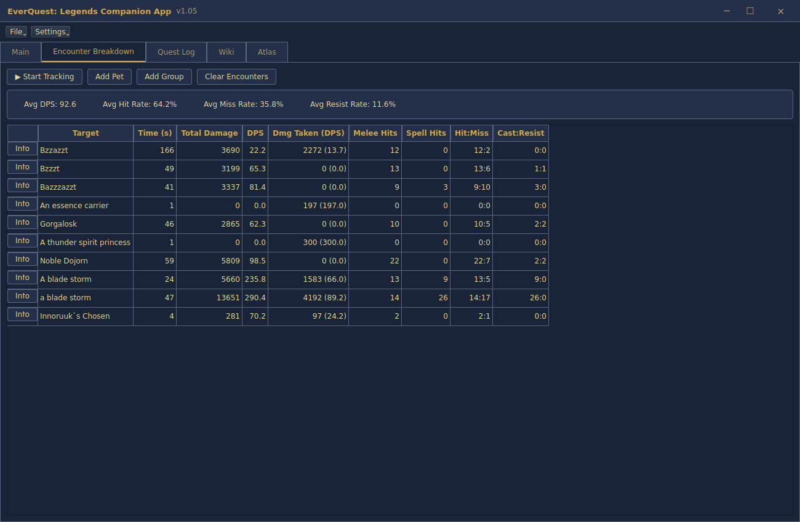
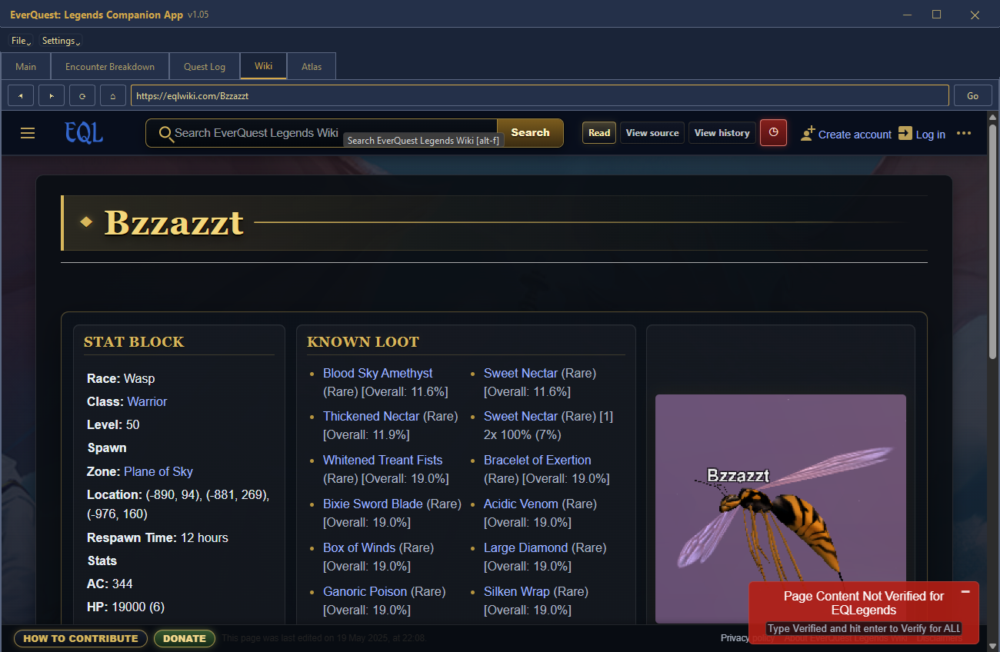
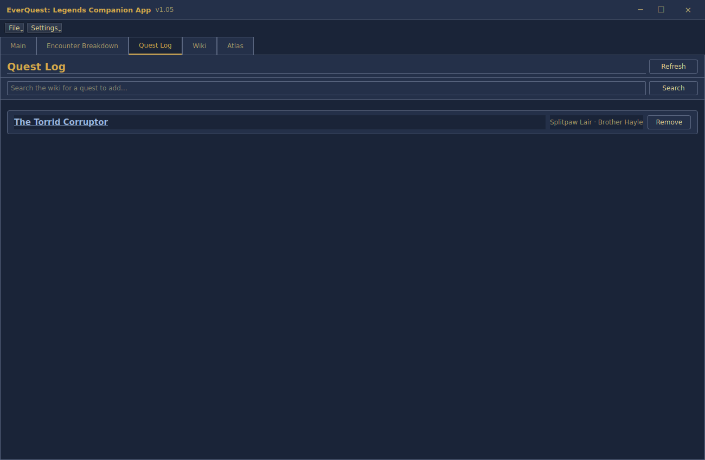
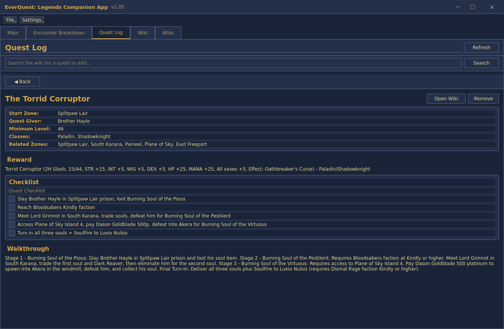
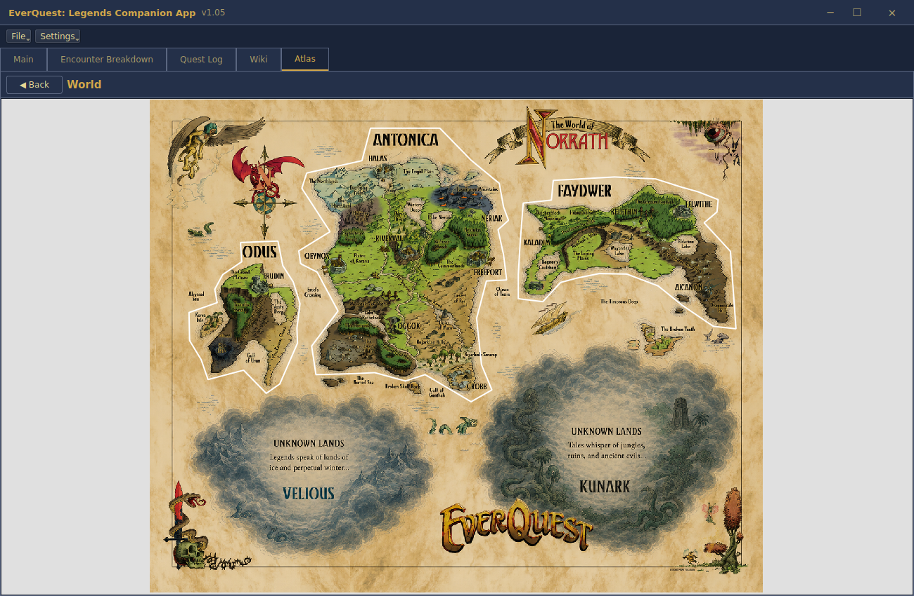
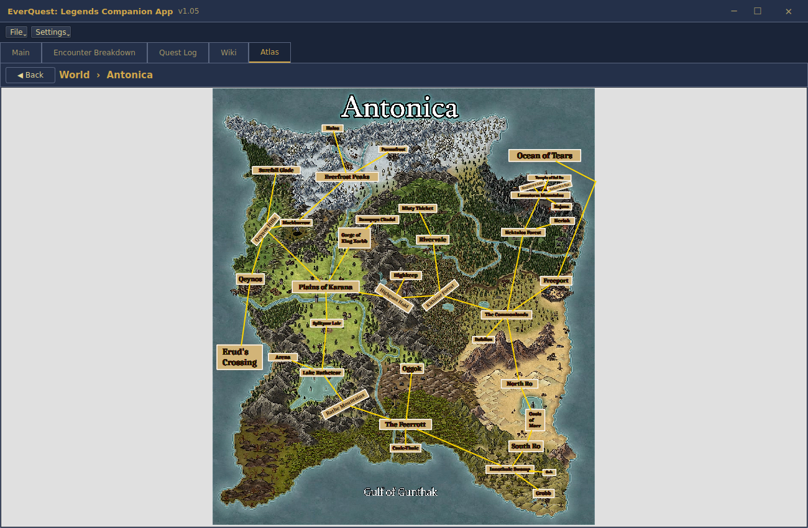
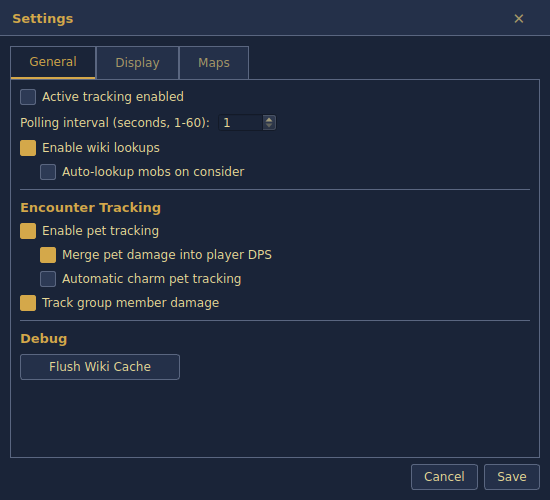

# EverQuest Legends Companion App (Unofficial)

> A work-in-progress companion tool designed to enhance the gameplay experience with map tracking, encounter parsing, wiki integration, and future progression tools.

---

## License

This project is licensed under the **Creative Commons Attribution-NoDerivatives 4.0 International License (CC BY-ND 4.0)**.
For more information, visit: [Creative Commons CC BY-ND 4.0 License](https://creativecommons.org/licenses/by-nd/4.0/)

---

## ⚠️ Important Notice

This project is currently a **WORK IN PROGRESS**. Expect bugs, incomplete systems, broken or unfinished features, and frequent changes.

I'm a full-time student and part-time worker developing this project in my free time. This is an unpaid passion project, so development progress may vary depending on my schedule.

The app is compiled using [Nuitka](https://nuitka.net/), which should reduce false positive malware flagging. Moving forward, all releases will be in EXE form only to speed up the release process.

> **Note:** the packaged app needs the [Microsoft Visual C++ Redistributable (x64)](https://learn.microsoft.com/en-us/cpp/windows/latest-supported-vc-redist) installed to run. If the app won't launch, install that first.

## 💾 Current Release

### ⬇️ [Download the latest EXE](https://github.com/MasterSloth/EverQuest-Legends-Companion-App-Unofficial/releases/tag/v1.05)

## 📋 Feedback & Bug Reports

If you encounter bugs or have suggestions:
- Please use the appropriate GitHub issue/report channels
- Bugs will be addressed on a triage basis
- Feature requests and ideas are always welcome

Community feedback helps shape future development.

---

## Features

### :page_with_curl: Main Tab

**Current features**
- Session Statistics (See Below)
- DPS/Encounter Tracking (See Below)
- Optional display for the in-game map in an attached window.
  - Reads the currently selected player log to track your current zone, detect zone changes, and automatically update displayed maps
  - Built-in map search functionality
  - NPC search and highlighting on the active map
  - Wiki lookup integration for zones and NPCs

**Notes**
- This application does **not** include map files — you must supply your own maps ([recommended: Brewall's Maps](https://www.eqmaps.info/))
- The developers are slowly updating their own map files for the game, once those are feature complete we will be swapping over to them, in the meantime we use Brewalls.
- Location tracking is not continuous by default — the `/loc` command updates your position, and binding it to a movement key can simulate live position tracking

**Planned improvements:** additional map functionality, expanded search capabilities, quality-of-life improvements, general UI polish.

---

### 📊 Session Statistics

*(shown on the Main tab, above)*

**Current features**
- Estimates EXP gain per hour in percentage format
- Reads the log for your last level up and attempts to calculate your current EXP percentage
- Estimates the amount of kills needed to level, based on current level percentage and the EXP gained from the last encounter

**Notes**
- The level/EXP feature is extremely temperamental because of EQ:L's multi-class, single-character system
- When you swap classes, the log doesn't show that your level may have changed, so the program won't update until your next level-up event

---

### ⚔️ DPS / Encounter Tracker *(WIP)*

*(shown on the Main tab, above)*

**Current features**
- Detects encounter start/end from the selected player log
- Tracks damage dealt, encounter duration, and calculated DPS
- Manual encounter deletion
- Manual tracking of group members (automating this is difficult — it's hard to tell who's in your party from the log alone)
- Pet damage tracking, combined or separated from player DPS
- Wiki lookup support for encounter NPCs

---

### ⚔️ Encounter Breakdown Tab *(WIP)*

**Current features**
- Displays additional information for each encounter
- Tracks pets/group members (added manually; charms can be tracked automatically), encounter length, total damage, DPS, hits and misses (+ ratio), casts and resists (+ ratio)

---

### 🌐 Wiki Tab

**Current features**
- Full embedded eqlwiki.com browser, right inside the app — browse and search the wiki like normal
- Automatically detects quest pages and shows an **"+ Add to Quest Log"** button
- Navigation is locked to eqlwiki.com — links to other sites open in your system browser instead

---

### 📜 Quest Log Tab *(WIP)*

**Current features**
- Quest tracking via wiki search or directly from the Wiki tab
- Quests listed by title only — click one to open its full detail view (start zone, quest giver, level, classes, rewards, checklist, walkthrough)
- Built-in checklist mirroring the wiki's own checkbox system, so you can track your own progress
- Manual quest removal

**Planned features:** 
- Loot notifications for tracked quest items, completed quest archive, duplicate quest warning prompts.

---

### 🗺️ Atlas Tab *(WIP)*

**Current features**
- Full world map for Classic EverQuest
- Click through into individual continental maps, each with a full list of zones
- Click through into individual zones that load a local map for that zone
- Zone line connections to make traveling and finding your way around easier

---

### ⚙️ Settings Menu

**Current features**
- **Active tracking** — lets the program actively read your log file to parse it, with a configurable polling interval
- **Wiki lookups** — the app uses the EQ:L Wiki
  - Auto-lookup mobs on consider (scans the log for NPC considers and displays a wiki page if it finds a match) — still a work in progress, as the wiki isn't up to date for all newer NPCs
- **Pet tracking** — enables the "Add Pet" button to track pets during encounters, with an option to merge pet damage into player DPS
- **Group tracking** — enables the "Add Group" button to add group members to encounter tracking
- **Flush Wiki Cache** — debug feature, use if the wiki isn't displaying correctly or something seems wrong

---

## Planned Features

### 🗡️ Epic Weapons 1.0 Tracker
Class selection, step-by-step progression tracking, loot/item tracking, completion checklists. Feedback and ideas for this feature are appreciated.

### 🛠️ Tradeskills Tab
Tradeskill selection, skill level tracking, progression guides, vendor/trainer lookup tools, wiki integration.

### 🧭 Gearing Guide
Recommended dungeons, NPCs, items, and hunt locations, based on selected class, current level, and available wiki data.

### 🐾 Pet Guide
A future feature dependent on community theorycrafting and available pet research/resources.

---

## Possible Future Features

These may be added depending on community feedback and demand.

### ⏱️ Buff / Debuff Tracking
Buff timers, debuff timers, status tracking. Currently lower priority due to existing in-game solutions, but this may change if heavily requested.

---

## Contributing

Community feedback, bug reports, and feature suggestions are highly appreciated. If you'd like to help improve the project: open an issue, suggest features, report bugs, or share ideas and feedback.

---

## Status

🚧 Active Development — this project is evolving continuously and features may change frequently.

